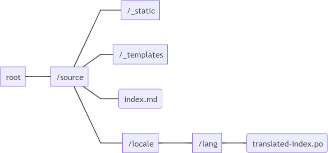
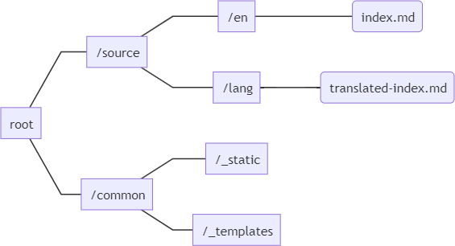

# docs-site
Source for the BTE ReadTheDocs Sphinx Setup. Exclusively contains configuration and custom code that doesn't belong in the actual documentation. If you're looking for the Documentation content, head over to the [BuildTheEarth/docs](https://github.com/BuildTheEarth/docs) repo.

## Contributing to Development
<!--TODO: Enforce usage of pyenv. Environment isolation is pretty important.
    TODO: Update Mermaid Diagrams. Repo no longer under bteguide name.-->

Install the required packages with:
```
 $ pip install -r requirements.txt
```

The Makefile and make.bat are both configured with Live Reload enabled. Start the live server with:

**Windows**
```
 $ .\make.bat livehtml
```
**Linux/macOS**
```
 $ make livehtml
```

## Fetching/Updating the source documents

Fetching the source for the documents manually:
```
 $ git submodule update --remote --init
```
You should rarely ever need to do this, just keep your repo updated via `git pull`.

## Workflow

Previously, when we were using the sphinx-quickstart configuration, much of the documentation ended up cluttering up the site code. Translation was also very difficult via `sphinx-intl` for a variety of reasons. 
1. The root index file (which would be considered as a document) and the base source weren't isolated, which meant that the site directory during translation was like this:

   <!--```mermaid
   graph LR
       root --- /source
       /source --- /_static
       /source --- /_templates
       /source --- a(index.md)
       /source --- /locale
       /locale --- /lang
       /lang --- b(translated-index.po)
   ```--->

   

   Rather than a flatter, more straightforward and better isolated directory tree:

   <!---```mermaid
   graph LR
       root --- /source
       root --- /common
       /common --- /_static
       /common --- /_templates
       /source --- /en
       /en --- a(index.md)
       /source --- /lang
       /lang --- b(translated-index.md)
   ```--->
   

2. `sphinx-intl` requires the use of `gettext`. While it is industry-standard, to need to pay entire platforms like Transifex or Crowdin to handle our _strings_ is absurd, seeing how it is only `gettext`'s own unnecessary complexity that has lead to the state of the i18n industry. The string method of translation simply does not serve our wiki-style needs. The need to _build_ from .po, then .mo files? Far too convoluted, and I don't expect our translators to want to deal with not just 2 times the content per document, but 3 times the files!

3. `gettext` would also require a specialised .po file editor to handle formatting properly, which is **3 extra layers of complexity** (.po+.mo building, translation, _compilation_) for translators over what source content copywriters already have to do.

Clearly sphinx's i18n feature needs work. As expected, we went with the flattened site directory, which separated site code from content and documentation.

   <!--```mermaid
   graph LR
       root --- /source
       subgraph "Website Code Repo (docs-site)"
       root --- /common
       /common --- /_static
       /common --- /_templates
       end
       subgraph "Content Repo (docs)"
       /source --- /en
           /en --- a(index.md)
       /source --- /lang
           /lang --- b(translated-index.md)
       /source ---c(conf.py)
       end
   ```--->
   

Of course, this was not how Sphinx intended things to be. So in order to enforce that separation and clean up the repo in the process for copywriters, compromises had to be made. 
- The `/source` directory is the entire `docs` repo, which is placed there via `git`'s Submodules feature. **Git Submodules are notoriously finicky**. But over Git Subtree they do allow us to work with our submodule source locally in a nested and isolated fashion.
  
- `conf.py`, a file that would be considered as website-specific code, has to stay in the submodule repo in order for the documentation to be recognised without adding an extra directory layer in between /source and any /lang. This isn't a big deal, but it breaks the code/documentation split.
  
- For any change in the documentation to be pushed live, a series of automated steps occur (Thank GitHub Actions!). 

  1. The documentation edit is committed and pushed to the `docs` repo.
  2. `trigger-docs-fetch` triggers `docs-fetch` on this repo. 
  3. The submodule update is committed and pushed by `docs-fetch`.
  4. A build is triggered on the ReadTheDocs project via webhook.

Of course, if there are more elegant solutions or alternatives to what we have now, please do contact EzraEn#4291 on [the Discord](https://discord.com/invite/3mrQBYd) and give us your suggestions!
